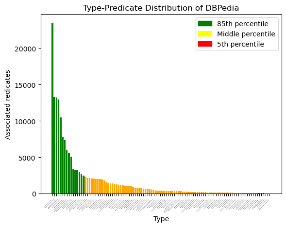
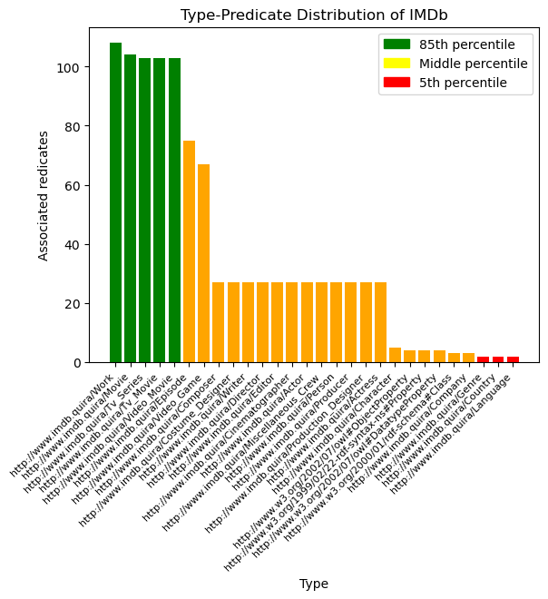

# Dataset analysis

The two DBpedia datasets we have analyzed, while similar in size, have very different type taxonomies and predicate distributions, as shown in the table below.

|      Dataset      |   #Triples  |  #Subjects | #Predicates |   #Objects   | #Types |
|:-----------------:|:-----------:|:----------:|:-----------:|:------------:|:------:|
| DBpedia-Entity v2 | 212,737,087 | 19,781,237 |      61,828 | 45,617,502   |    385 |
| IMDb              | 181,654,004 | 26,084,168 |         133 |   37,210,281 |     28 |

  

While DBpedia has a very broad type taxonomy, which is even more extensive in newer (>2016) versions, IMDb consists of only a handful of types, as its domain is closed down to to cinema-related entities.
This behavior can also be seen on the predicates, with IMDb containing a very reduced set of them and a very differentiated distribution of predicates across entities, depending on their type.

In order to analyze the effect of Type-based aggregators, we analyzed the predicate distributions of predicates across entity types on both KGs, shown in the two tables below. For this, a predicate $p$ is related with a type $t$ if it has a given metric's value >0 for it (that is, if an entity of type $t$ had a relation containing $p$) and thus a type-based VDoc template will contain it. While both KGs follow a power-law distribution, with a considerable number of *small* types containing few predicates and a few select broad types containing a big number of them, we found an interesting behavior on IMDb. 

In this KG, we have found that some entities with types such as `Actor`/`Actress` are very well described with many different possible predicates, other entities of types such as `Character`are very poorly described (for this latter case, we only found `label` and `count` attributes associated with it, and a relationship to the `Actor`/`Actress` they belong to). This leads us to believe that the dataset is incomplete, as characters are well-described in IMDb with, e.g, trivia and quotes which `Actor`/`Actress` entities actually have.

This situation has led us to suppress the `b` parameter on BM25F, as otherwise we would be penalizing well-described entities that would be treated as too-long documents.

  

